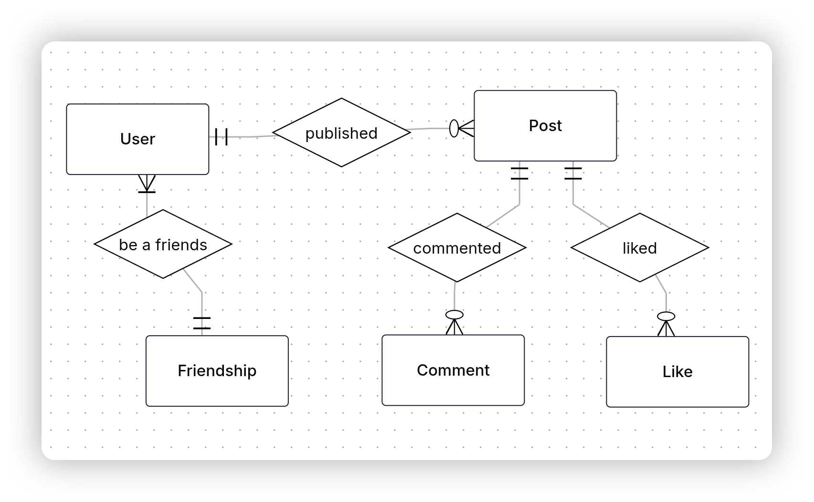
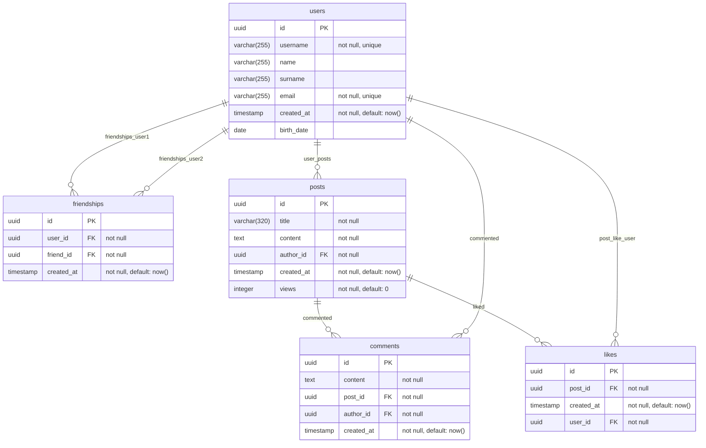
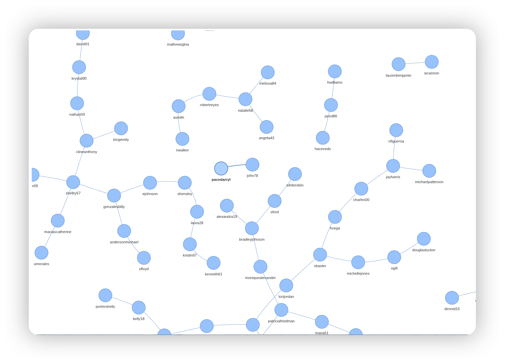

## Database for social network

Tablse: `users`, `posts`, `comments`, `likes`, `friendships`

Analytics requests:

1. Calculate the "engagement index" for each user: (comments + likes on his posts) / (his own actions), rank users.

2. Identify users whose average number of reactions to a post is significantly higher than the average on the network.

## Conceptual schema


## Logical schema


## How run it
Run `socnet` database with empty tables:
```sh
docker run -d -p 5432:5432 \
  -e POSTGRES_PASSWORD=<your-password> \
  alchemmist/socnet-db:latest
```
Or run with sample data:
```sh
docker run -d -p 5432:5432 \
  -e POSTGRES_PASSWORD=<your-password> \
  -e LOAD_SAMPLE_DATA=true \
  alchemmist/socnet-db:latest
```
And you can add `REGENERATE_SAMPLE_DATA=true` option and before starting postgres `seed.sql` will be regenerated with new data.

The same options you set more useful with `compose.yaml` like this:
```yaml
services:
  db:
    image: alchemmist/socnet-db:latest
    container_name: socnet-db
    ports:
      - "5432:5432"
    environment:
      POSTGRES_PASSWORD: <your-password>
      LOAD_SAMPLE_DATA: "true"
      REGENERATE_SAMPLE_DATA: "true"
      : "true"
    volumes:
      - socnet-data:/var/lib/postgresql/data

volumes:
  socnet-data:
```

## How to use it
After running you can connect and working with database with:
```sh
psql -h localhost -p 5432 -U admin -d socnet
```
Also, you can see the graph of friendships:
```sh
uv run --with-requirements=scripts/requirements.txt scripts/show-graph.py \ 
    --host localhost \
    --port 5432 \
    --dbname socnet \
    --user admin \
    --password <your-password>
```
This command will open tab in your default browser with firendships graph:

