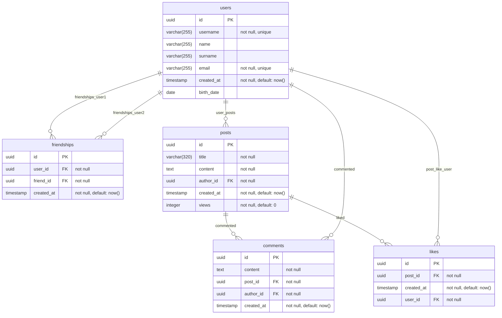

<h2> socnet-db</h2>

[](https://github.com/alchemmist/socnet-db)


[](https://centraluniversity.ru/)

Project architect: [@alchemmist](https://github.com/alchemmist)

This project provides a fully containerized PostgreSQL-based analytical and transactional environment for a simplified social network domain, making as lab-work at Central University. It includes database schema definition, SCD Type 2 versioning logic, data validation mechanisms, synthetic data generation, analytics data marts, and automated test scenarios. Key capabilities include:

## Features

**Core Data Model:**

- Relational schema representing users, posts, comments, likes, and friendship relationships.
- Strong typing and referential integrity constraints across all relations.
- Support for history tracking through optional SCD Type 2 versioning of user profiles.

**SCD Type 2 Change Tracking:**

- Custom composite type (`user_scd2_type`) for structured user-change events.
- Procedural loader (`scd2_load_users`) that applies SCD2 logic:
  - Detecting attribute changes
  - Closing existing records
  - Opening new versioned rows
  - Maintaining metadata: `valid_from`, `valid_to`, `is_current`
- Optional automated update tests that generate single-row SCD2 updates per table.

**Email Validation Trigger:**

- Server-side validation using `validate_email()` trigger function.
- Rejects malformed email addresses or logs them for inspection.
- Ensures application-level correctness via database-level enforcement.

**Sample Data Generator:**

- Parameterized synthetic dataset generator (`03_seed.sql`):
  - Users, posts, comments, likes, and friendships.
- Deterministic generation for reproducible runs.
- Can be regenerated on startup depending on environment configuration.

**Analytical Layer:**

- Calculate the "engagement index" for each user: (comments + likes on his posts) / (his own actions), rank users.
- Identify users whose average number of reactions to a post is significantly higher than the average on the network.

**Testing Framework:**

- SQL-based regression tests covering:
  - Email validation
  - SCD2 versioning updates
- Automatic execution on container startup when enabled.

**Docker Integration:**

- Fully automated initialization flow using `/docker-entrypoint-initdb.d`.
- Environment-variable-driven configuration for flexible behavior.
- Supports reproducible development and controlled data regeneration.

Tablse: `users`, `posts`, `comments`, `likes`, `friendships`

## Architecture overview
**1. Schema Layer** (`01_schema.sql`)

Defines all base relations, types, constraints, indexes, and reference structures. This layer ensures the database has a stable transactional foundation.

**2. Validation Layer** (`02_email_validate_trigger.sql`)

Contains the `validate_email()` function and its associated trigger. Executed conditionally depending on environment flags.

**3. Data Generation Layer** (`03_seed.sql`)

Generates synthetic data driven by environment variables such as number of users, posts, comments, likes, and friendships.

**4. SCD2 Layer** (`04_scd2_loader.sql`)

Implements SCD2 machinery: composite types, loader procedures, change tracking logic, and optional SCD test insert/update events.

**5. Analytics Layer** (`src/analytics/`)

Houses analytical views and data mart definitions. These structures are read-only from user perspective and provide aggregated, business-level metrics.

**6. Test Layer** (`src/tests/`)

Provides SQL test scripts intended for automatic execution in controlled environments. Tests validate correctness of triggers, SCD2 operations, and schema assumptions.

**7. Utility Scripts** (`scripts/`)

Contains helper tools (Python or SQL) used for visualization or data inspection during development.


## Conceptual schema


## Logical schema



## How run it

Run `socnet` database with empty tables:

```sh
docker run -d -p 5432:5432 \
  -e POSTGRES_PASSWORD=<your-password> \
  alchemmist/socnet-db:latest
```

Or run with sample data:

```sh
docker run -d -p 5432:5432 \
  -e POSTGRES_PASSWORD=<your-password> \
  -e LOAD_SAMPLE_DATA=true \
  alchemmist/socnet-db:latest
```

And you can add `REGENERATE_SAMPLE_DATA=true` option and before starting postgres `seed.sql` will be regenerated with new data.

The same options you set more useful with `compose.yaml` like this:

```yaml
services:
  db:
    image: alchemmist/socnet-db:latest
    container_name: socnet-db
    ports:
      - "5432:5432"
    environment:
      POSTGRES_PASSWORD: <your-password>
      LOAD_SAMPLE_DATA: "true"
      REGENERATE_SAMPLE_DATA: "true"
      : "true"
    volumes:
      - socnet-data:/var/lib/postgresql/data

volumes:
  socnet-data:
```

## How to use it

After running you can connect and working with database with:

```sh
psql -h localhost -p 5432 -U admin -d socnet
```

Also, you can see the graph of friendships:

```sh
uv run --with-requirements=scripts/requirements.txt scripts/show-graph.py \
    --host localhost \
    --port 5432 \
    --dbname socnet \
    --user admin \
    --password <your-password>
```

This command will open tab in your default browser with firendships graph:


## Configuring

The behavior of the container is controlled entirely through environment variables. They define data-loading behavior, trigger activation, test execution, dataset sizes, and global PostgreSQL parameters.

**PostgreSQL Core Variables**:
|Variable|Description|Default|
|---|---|---|
|`POSTGRES_DB`|Name of the PostgreSQL database created on startup.|`socnet`|
|`POSTGRES_USER`|Database superuser created on startup.|`admin`|
|`POSTGRES_PASSWORD`|Password for the PostgreSQL superuser.|**(required)**|

**Data Loading & Generation Options**:
|Variable|Description|Default|
|---|---|---|
|`LOAD_SAMPLE_DATA`|Enables loading synthetic data during initialization. When `false`, only the schema is created.|`false`|
|`REGENERATE_SAMPLE_DATA`|Forces regeneration of sample data even if it exists. This overwrites any previous synthetic dataset.|`false`|
|`USE_SCD2_VERSIONING`|Enables SCD Type 2 versioning logic and loads SCD structures and procedures.|`false`|
|`TEST_UPDATES_FOR_SCD`|Executes SCD2 test updates, generating one update event per target table.|`false`|
|`EMAIL_VALIDATE_TRIGGER`|Enables the email validation trigger on the `users` table.|`true`|

**Dataset Size Parameter**. These options control the synthetic dataset generator. Increasing values produces proportionally larger test datasets.

| Variable          | Description                           | Default |
| ----------------- | ------------------------------------- | ------- |
| `NUM_USERS`       | Number of users to generate.          | `10`    |
| `NUM_POSTS`       | Number of posts to generate.          | `50`    |
| `NUM_COMMENTS`    | Number of comments to generate.       | `50`    |
| `NUM_LIKES`       | Number of likes to generate.          | `100`   |
| `NUM_FRIENDSHIPS` | Number of friendship edges to create. | `5`     |

