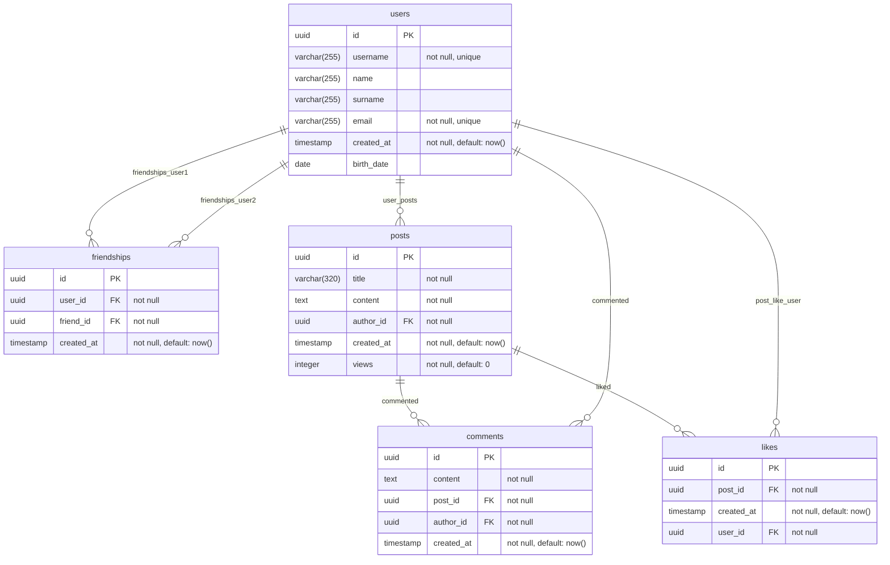

## Database for social network

Tablse: `users`, `posts`, `comments`, `likes`, `friendships`

Analytics requests:

1. Calculate the "engagement index" for each user: (comments + likes on his posts) / (his own actions), rank users.

2. Identify users whose average number of reactions to a post is significantly higher than the average on the network.

## Conceptual schema

## Logical schema

